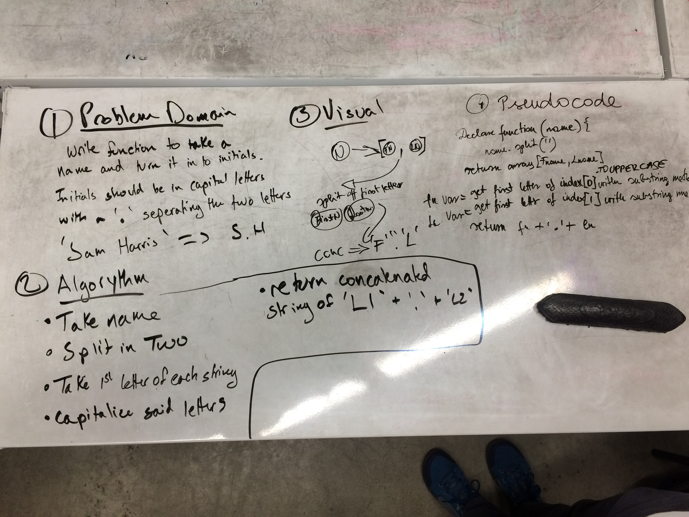

*Details of This Kata*

# Abbreviate a Two Word Name

`Write a function to convert a name into initials. This kata strictly takes two words with one space in between them.`

`The output should be two capital letters with a dot seperating them.`

`It should look like this:`

`Sam Harris => S.H`

`Patrick Feeney => P.F`

My partner was Timea Heidenreich

Psuedo Code: 

Link to: [https://www.codewars.com/kata/abbreviate-a-two-word-name/train/javascript](https://www.codewars.com/kata/abbreviate-a-two-word-name/train/javascript)